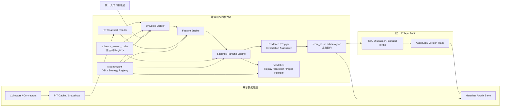

# 项目说明

> **定位**：这是 AI 投顾项目中"研究中台 / 策略内核"的控制层定义仓库。  
> 它不负责"抓数据"或"渲染聊天"，而是回答三件事：  
> 1. 策略到底怎么定义、研究范围是什么、怎么打分  
> 2. 研究结果必须长成什么结构  
> 3. 为什么纳入 / 排除 / 降级 / 阻断，要用什么稳定语言表达

---

# 一、项目目标与边界

## 研究层分级

| 层级 | 含义 | 首版范围 |
|------|------|---------|
| **R0** | 确定性研究结论 — 结构化评分 + 审计 + 免责 | ✅ 首版目标 |
| **R1** | 研究辅助动作 — 仓位建议、观察池管理 | ❌ 不纳入首版 |
| **R2** | 自主执行动作 — 自动交易、组合优化 | ❌ 不纳入首版 |

## 当前不做

- 自动仓位建议 / 自动买卖动作
- 组合优化 / 下单执行
- 个性化收益承诺

---

# 二、AI 投顾整体架构图

```text
┌──────────────────────────── AI 投顾整体架构 ────────────────────────────┐
│                                                                        │
│ 1. 渠道层                                                              │
│    WeCom / Discord / API / Chat / Dashboard / Digest                   │
│                         │                                              │
│                         ▼                                              │
│ 2. 统一入口与顾问编排层                                                │
│    Request Normalizer / Session / User Context / Permission            │
│                         │                                              │
│                         ▼                                              │
│ 3. 研究中台 / 策略内核                                                 │
│                                                                        │
│    ┌────────────── 策略控制层（定义资产）──────────────────────┐       │
│    │ strategy.yaml            → 策略 DSL / 策略注册表          │       │
│    │ score_result.schema.json → 结果输出契约                   │       │
│    │ universe_reason_codes    → 原因码 / 审计词汇表            │       │
│    └───────────────────────────────────────────────────────────┘       │
│                                                                        │
│    Universe Builder                                                    │
│      → PIT Snapshot Reader                                             │
│      → Feature Engine                                                  │
│      → Scoring / Ranking Engine                                        │
│      → Evidence / Trigger / Invalidation Assembler                     │
│                         │                                              │
│                         ▼                                              │
│ 4. Policy / Suitability / Audit                                        │
│    Tier / Disclaimer / Banned Terms / Audit Log / Version Trace        │
│                         │                                              │
│                         ▼                                              │
│ 5. Renderer / Delivery                                                 │
│    WeCom / Discord / API JSON / Dashboard / Digest                     │
│                                                                        │
│ 旁路支撑层                                                             │
│    Collectors → Cache / PIT Snapshots → Feature Store / Metadata       │
│    Backtest / Replay / Paper Portfolio / Attribution → 策略升级         │
│                                                                        │
└────────────────────────────────────────────────────────────────────────┘
```

---

# 三、策略内核专项放大图



## 模块职责

| 模块 | 职责 | 输入 | 输出 |
|------|------|------|------|
| Universe Builder | 构建可研究股票池 | strategy.yaml + PIT snapshots + reason codes | universe membership + inclusion/exclusion reasons |
| PIT Snapshot Reader | 读取时点数据快照 | PIT Cache | 标的级时点数据帧 |
| Feature Engine | 计算特征 | strategy.yaml feature_groups + PIT 数据 | 归一化特征向量 |
| Scoring / Ranking Engine | 评分排名 | 特征向量 + 权重 + risk overlays | sub_scores + total_score + rank |
| Evidence Assembler | 组装证据 | 评分结果 + PIT 数据 | drivers / risks / triggers / invalidation |
| Validation | 回测与验证 | 历史 score results + 行情数据 | promotion gate 结果 |

---

# 四、技术基线

## MVP 默认栈

| 层次 | 选型 | 说明 |
|------|------|------|
| 语言 | Python 3.11+ | 研究中台标准 |
| 数据处理 | Polars | 高性能 DataFrame |
| 本地存储 | DuckDB + Parquet | MVP 无需外部数据库 |
| Schema 验证 | Pydantic v2 | runtime model，JSON Schema 由代码生成 |
| 调度 | CLI + cron | MVP 不需要 worker |
| HTTP（可选） | FastAPI | 仅在需要 API 时引入 |

## 服务化后候选

| 升级方向 | 选型 |
|---------|------|
| 持久化存储 | PostgreSQL |
| 任务队列 | Redis + Celery |
| 审计存储 | PostgreSQL / ClickHouse |

---

# 五、开发环境约定

| 项目 | 工具 |
|------|------|
| 包管理 | uv + pyproject.toml |
| 代码格式 | ruff format |
| Lint | ruff check |
| 类型检查 | mypy (strict) |
| 测试 | pytest |
| Pre-commit | ruff + mypy |
| 锁文件 | uv.lock |

不使用 Poetry/pip 双轨。

---

# 六、OpenClaw 边界说明

本项目提到的"基于 OpenClaw"指的是：

- **渠道层 / 统一入口**：借鉴 OpenClaw 的多渠道 inbox、session、tool 编排模式
- **策略内核不依赖 OpenClaw 运行时**：strategy kernel 必须可以脱离 OpenClaw 独立运行。CLI、测试、回放、paper run 都不应引入 OpenClaw 依赖

OpenClaw 存在于第 1-2 层（渠道 + 编排），不进入第 3 层（策略内核）。

---

# 七、策略定义资产

三份核心资产及其角色：

| 文件 | 角色 | 位置 |
|------|------|------|
| `strategy.yaml` | 策略 DSL / 策略注册表 | 策略控制层 |
| `score_result.schema.json` | 研究结果输出契约 | 内核与下游交付的边界 |
| `universe_reason_codes.yaml` | 机器可读原因码注册表 | Universe / Policy / Audit 交叉层 |
| `universe_reason_codes.md` | 原因码人类可读说明文档 | 同上 |
| `data_freshness_profiles.yaml` | 数据时效 SLA 定义 | 数据契约层 |

### Code 命名规范

| 前缀 | 含义 | 使用位置 |
|------|------|---------|
| `INC_*` | 纳入原因 | `inclusion_reasons` |
| `CND_*` | 候选来源 | `inclusion_reasons` |
| `EXC_*` | 排除原因 | `exclusion_reasons` |
| `DGD_*` | 降级原因 | `state_reason_codes` |
| `BLK_*` | 阻断原因 | `state_reason_codes` |
| `RISK_*` | 风险叠加码 | `penalties[*].code` / `risks[*].code` |
| `DRV_*` | 驱动项 | `drivers[*].code` |
| `TRG_*` | 触发器 | `triggers[*].code` |
| `INV_*` | 失效条件 | `invalidation[*].code` |

### 长期演进

- `score_result.schema.json` 最终由 **Pydantic model 生成**，CI 校验 schema 是否漂移
- `universe_reason_codes.md` 保留给人读，`universe_reason_codes.yaml` 为 runtime 唯一机器可读源

---

# 八、数据契约与 freshness profile

## PIT 必要字段

所有进入策略内核的数据必须带以下 Point-in-Time 字段：

```yaml
- published_at     # 数据发布时间
- available_at     # 数据可获取时间
- retrieved_at     # 数据实际抓取时间
- asof             # 研究时点
- source_name      # 数据源名称
- source_hash      # 数据快照哈希
- parser_version   # 解析器版本
```

## 时效 SLA

时效阈值定义在 `data_freshness_profiles.yaml` 中，由 `strategy.yaml` 的 `data_freshness_profile_ref` 引用。

超时行为：
- **degrade**：降级输出，标记相应 `DGD_*` 码
- **block**：阻断输出，标记相应 `BLK_*` 码

---

# 九、输出契约与状态机

## 状态定义

| 状态 | 含义 | `total_score` | `rank` / `percentile_rank` | `state_reason_codes` |
|------|------|---------------|---------------------------|---------------------|
| `ok` | 正常研究结论 | 0~100 | 有值 | `[]` |
| `degraded` | 结论可用但质量下降 | 0~100 | 有值 | 非空 |
| `blocked` | 不允许形成正常结论 | **null** | **null** | 非空 |

## 计分公式

```
total_score = clamp(
  sum(sub_scores.values()) + sum(penalties[*].score_impact),
  0,
  100
)
```

当 `result_state = blocked` 时，`total_score = null`，不伪装为 0 分。

## required fields

所有输出必须包含以下字段（详见 `score_result.schema.json` required）：

`request_id`, `run_id`, `asof`, `strategy_id`, `strategy_version`, `universe_version`, `data_version`, `feature_version`, `policy_version`, `security`, `universe_membership`, `result_state`, `state_reason_codes`, `total_score`, `rank`, `percentile_rank`, `sub_scores`, `penalties`, `label`, `confidence`, `drivers`, `risks`, `triggers`, `invalidation`, `data_quality`, `audit`

---

# 十、版本流转与审计

每次研究结果输出必须携带完整版本链：

| 字段 | 含义 | 变更触发 |
|------|------|---------|
| `strategy_version` | 策略定义版本 | 修改 strategy.yaml |
| `universe_version` | 股票池版本 | universe 规则/种子变更 |
| `data_version` | 底层数据快照版本 | 数据更新 |
| `feature_version` | 特征工程版本 | 特征计算逻辑变更 |
| `policy_version` | 策略/合规模块版本 | 合规规则变更 |

审计日志必须包含：
- 完整版本链
- `applied_reason_codes`（本次运行命中的所有原因码）
- `source_hashes`（关键数据快照 hash）
- `request_id` + `run_id`（可追溯性）

---

# 十一、首版 MVP 与里程碑

## MVP0：内核打通版

- 使用 **frozen PIT snapshots**（`data/sample_snapshots/`）
- 跑一个**小型固定 universe**（100~300 只样本股）
- 完成：
  - Universe Builder → Feature Engine → Scoring Engine
  - 输出 `score_result.json` 符合 schema 校验
  - 生成横截面排名
  - 生成单股渲染结果
  - audit trace 完整
  - degraded / blocked 标记正确
- **能复跑、能比对、能审计**

## MVP1：首个可用版

- 接入 **1 套 live connector**（验证阶段用 AKShare）
- 每个交易日盘后自动生成当日 snapshot
- 跑目标 universe
- 输出：每日榜单 + 单股研究结果 + audit trace
- 仍然只做 **R0**

> **单股通路只是 smoke test，不是策略 MVP。**  
> 策略 MVP 至少要有"横截面 universe + 排名 + 契约输出 + 审计"。

## Promotion Gate

策略从 draft → active 需通过：
- top quintile spread 为正
- rank IC 正向比率 ≥ 0.55
- 换手率在限制范围内
- 单行业权重 ≤ 35%

---

# 十二、数据源接入策略

## 原则

- **策略层 provider-agnostic**：`strategy.yaml` 不绑定任何数据供应商
- **connector 层允许替换**：一个接口，多个实现
- **真值层与 transport 层分离**

## 演进路径

| 阶段 | 数据源 | 说明 |
|------|--------|------|
| **测试/CI** | frozen snapshots + golden fixtures | 测试永远不依赖 live 数据 |
| **验证阶段** | AKShare connector + 交易所公告 | 1 个可替换行情/财务 connector |
| **生产阶段** | 替换为更稳定 provider | 不改 strategy contract |

## MVP1 已知简化（待后续回归加强）

> [!WARNING]
> 以下简化项在 MVP1 中采用，后续版本必须回归并加强。

| 编号 | 简化项 | MVP1 做法 | 目标做法 | 回归版本 |
|------|--------|----------|---------|---------|
| S-01 | `gross_margin_stability` 窗口 | **4Q**（最近 4 季度标准差倒数） | 12Q（12 季度） | MVP2 |
| S-02 | 行业分类 | **东财行业板块** | 申万行业 L1/L2 标准分类 | MVP2 |
| S-03 | `risk_goodwill_high` | **简单阈值**：商誉/净资产 > 30% | 复合判断：商誉增速 + 减值风险模型 | MVP2 |
| S-04 | `risk_equity_pledge_high` | **简单阈值**：质押比例 > 50% | 加入爆仓线距离 + 大股东质押比例 | MVP2 |
| S-05 | `risk_regulatory_probe` | **公告关键词匹配** | NLP 分类 + 严重性评估 | MVP2+ |
| S-06 | `risk_material_negative_announcement` | **暂跳过**（默认 False） | 接入公告 NLP pipeline | MVP2+ |
| S-07 | Data freshness SLA | **暂跳过** | 按 `data_freshness_profiles.yaml` 检查 | MVP2 |

---

# 十三、首版仓库目录结构

```text
ai-investment-consultant/
├─ AGENT.md
├─ pyproject.toml
├─ uv.lock
├─ .env.example
├─ src/
│  └─ ai_investor/
│     ├─ api/                          # HTTP API（MVP 可选）
│     │  ├─ routes/
│     │  └─ schemas/
│     ├─ orchestrator/                 # 请求编排
│     │  ├─ request_normalizer.py
│     │  └─ dispatch.py
│     ├─ strategy/                     # 策略控制层
│     │  ├─ registry/
│     │  │  └─ ashare_quality_cashflow_regime_v1/
│     │  │     ├─ strategy.yaml
│     │  │     ├─ score_result.schema.json
│     │  │     ├─ universe_reason_codes.yaml
│     │  │     ├─ universe_reason_codes.md
│     │  │     └─ data_freshness_profiles.yaml
│     │  ├─ loader.py
│     │  └─ validator.py
│     ├─ collectors/                   # 数据采集 connectors
│     ├─ snapshots/                    # PIT 快照管理
│     ├─ universe/                     # Universe Builder
│     ├─ features/                     # Feature Engine
│     ├─ scoring/                      # Scoring / Ranking
│     ├─ validation/                   # Backtest / Replay
│     ├─ policy/                       # Policy / Suitability
│     ├─ audit/                        # Audit Log
│     ├─ renderers/                    # 输出渲染
│     └─ common/                       # 共享工具
├─ tests/
│  ├─ unit/
│  ├─ integration/
│  ├─ contract/                        # schema 契约测试
│  └─ golden/                          # golden output 回归
├─ data/
│  ├─ sample_snapshots/                # 开发用冻结快照
│  └─ golden_results/                  # 期望输出
├─ scripts/
└─ docs/
```

策略定义资产放在 `src/ai_investor/strategy/registry/` 下，作为 **runtime-controlled assets** 管理。
